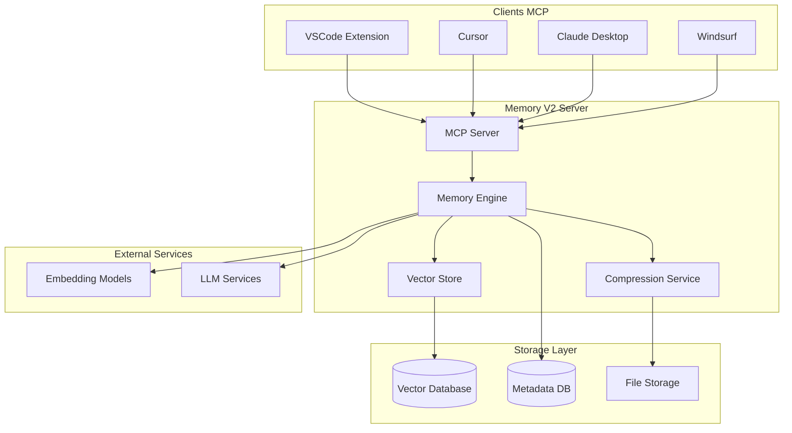
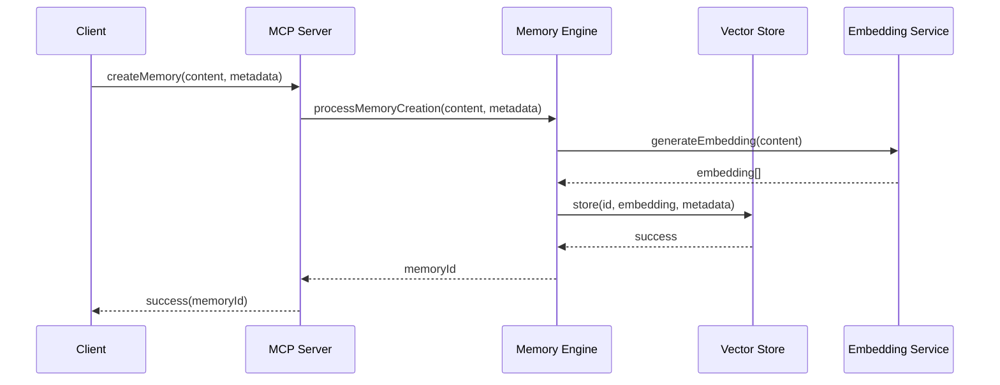
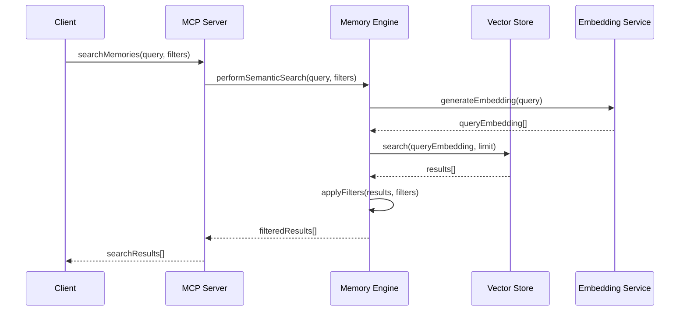

# 🏗️ Architecture Memory V2

## Vue d'ensemble

Memory V2 adopte une architecture modulaire basée sur le Model Context Protocol (MCP) pour créer une couche de mémoire persistante et contextuelle.

## Diagramme d'architecture



## Composants principaux

### 1. MCP Server
**Responsabilité**: Point d'entrée pour tous les clients MCP
**Technologies**: TypeScript, MCP SDK
**Fonctionnalités**:
- Gestion des connexions clients
- Routage des requêtes
- Authentification et autorisation
- Logging et monitoring

```typescript
interface MCPServer {
  start(): Promise<void>
  stop(): Promise<void>
  registerTool(tool: MCPTool): void
  handleRequest(request: MCPRequest): Promise<MCPResponse>
}
```

### 2. Memory Engine
**Responsabilité**: Logique métier de gestion des mémoires
**Technologies**: TypeScript, Mem0 concepts
**Fonctionnalités**:
- CRUD des mémoires
- Recherche sémantique
- Gestion du contexte
- Orchestration des services

```typescript
interface MemoryEngine {
  createMemory(content: string, metadata: MemoryMetadata): Promise<string>
  searchMemories(query: string, filters?: SearchFilters): Promise<Memory[]>
  getRelevantContext(query: string): Promise<ContextResult>
  compressMemories(criteria: CompressionCriteria): Promise<CompressionResult>
}
```

### 3. Vector Store
**Responsabilité**: Stockage et recherche vectorielle
**Technologies**: Vector Database (Chroma/Qdrant), Embeddings
**Fonctionnalités**:
- Stockage des embeddings
- Recherche par similarité
- Indexation vectorielle
- Optimisation des requêtes

```typescript
interface VectorStore {
  store(id: string, embedding: number[], metadata: object): Promise<void>
  search(query: number[], limit: number): Promise<SearchResult[]>
  delete(id: string): Promise<void>
  update(id: string, embedding: number[], metadata: object): Promise<void>
}
```

### 4. Compression Service
**Responsabilité**: Compression intelligente des mémoires
**Technologies**: LLM, Algorithmes de compression
**Fonctionnalités**:
- Détection des mémoires à compresser
- Compression contextuelle
- Préservation du sens
- Métriques de compression

## Flux de données

### 1. Création d'une mémoire


### 2. Recherche sémantique


## Modèle de données

### Memory Entity
```typescript
interface Memory {
  id: string
  content: string
  type: MemoryType
  embedding?: number[]
  metadata: MemoryMetadata
  created: Date
  updated: Date
  accessed: Date
  accessCount: number
  compressed: boolean
  compressionRatio?: number
}

interface MemoryMetadata {
  tags: string[]
  project?: string
  language?: string
  framework?: string
  importance: number
  category: string
  source: string
  context?: ContextInfo
}
```

### MCP Protocol Types
```typescript
interface MCPRequest {
  method: string
  params: object
  id: string
}

interface MCPResponse {
  result?: object
  error?: MCPError
  id: string
}

interface MCPTool {
  name: string
  description: string
  inputSchema: JSONSchema
  handler: (params: object) => Promise<object>
}
```

## Configuration

### Server Configuration
```typescript
interface ServerConfig {
  port: number
  host: string
  maxConnections: number
  timeout: number
  cors: CorsConfig
  auth: AuthConfig
}
```

### Memory Configuration
```typescript
interface MemoryConfig {
  maxMemories: number
  compressionThreshold: number
  embeddingModel: string
  vectorDimensions: number
  searchLimit: number
  cacheSize: number
}
```

## Sécurité

### Authentification
- Token-based authentication
- Client certificates pour MCP
- Rate limiting par client

### Autorisation
- Permissions granulaires par mémoire
- Isolation des données par utilisateur
- Audit trail des accès

### Chiffrement
- Chiffrement des données au repos
- TLS pour les communications
- Chiffrement des embeddings sensibles

## Performance

### Optimisations
- Cache en mémoire pour les mémoires fréquentes
- Indexation vectorielle optimisée
- Compression asynchrone
- Pagination des résultats

### Métriques
- Temps de réponse par opération
- Utilisation mémoire
- Taux de cache hit
- Qualité des embeddings

## Monitoring

### Logs structurés
```typescript
interface LogEntry {
  timestamp: Date
  level: LogLevel
  component: string
  operation: string
  duration?: number
  metadata: object
}
```

### Métriques
- Nombre de mémoires par type
- Fréquence d'accès
- Performance des recherches
- Taux de compression

## Évolutivité

### Scalabilité horizontale
- Serveurs MCP multiples
- Load balancing
- Sharding des données

### Extensibilité
- Plugins pour nouveaux types de mémoires
- Algorithmes de compression personnalisés
- Intégration avec nouveaux modèles d'embedding
